# Vortex Admin Pro — System Architecture & Flow Documentation

> Full system documentation: entities, DTOs, controllers, services, repositories, security, frontend, database schema, and all flowcharts.

---

## Table of Contents

1. [System Overview](#1-system-overview)
2. [Tech Stack](#2-tech-stack)
3. [High-Level Architecture Flow](#3-high-level-architecture-flow)
4. [Database Schema](#4-database-schema)
5. [Entity Classes](#5-entity-classes)
6. [DTO Classes](#6-dto-classes)
7. [Repository Layer](#7-repository-layer)
8. [Service Layer](#8-service-layer)
9. [Controller Layer (REST API)](#9-controller-layer-rest-api)
10. [Security Architecture](#10-security-architecture)
11. [Authentication & Authorization Flow](#11-authentication--authorization-flow)
12. [Frontend Architecture](#12-frontend-architecture)
13. [State Management](#13-state-management)
14. [API Service Layer (Frontend)](#14-api-service-layer-frontend)
15. [Feature Flowcharts](#15-feature-flowcharts)
16. [Permission Model](#16-permission-model)
17. [Real-Time Notification Flow](#17-real-time-notification-flow)
18. [File Upload Flow](#18-file-upload-flow)
19. [Billing & Subscription Flow](#19-billing--subscription-flow)
20. [Webhook Flow](#20-webhook-flow)

---

## 1. System Overview

```
┌─────────────────────────────────────────────────────────────────┐
│                      VORTEX ADMIN PRO                           │
│                   Enterprise SaaS Dashboard                     │
├────────────────────────┬────────────────────────────────────────┤
│   FRONTEND (React 18)  │        BACKEND (Spring Boot 3)        │
│   Port: 5173           │        Port: 8080                     │
│   Vite + TailwindCSS   │        Java 17 + PostgreSQL           │
└────────────────────────┴────────────────────────────────────────┘
```

**Core Capabilities:**
- JWT + OAuth2 (Google) Authentication
- Role-Based Access Control (RBAC) with granular permissions
- Multi-tenant Organization/Workspace management
- User, Task, Team, Event, File management
- Real-time notifications via SSE
- Audit logging & compliance
- Billing & subscription management
- API Key management with rate limiting
- Webhook endpoints
- AI-powered insights (Google Gemini)
- Two-Factor Authentication (TOTP)
- Export/Import (CSV, Excel)
- i18n: English, Thai, Chinese

---

## 2. Tech Stack

### Backend
| Technology | Version | Purpose |
|---|---|---|
| Java | 17 | Language |
| Spring Boot | 3.5.x | Framework |
| Spring Security | 6.x | Authentication & Authorization |
| Spring Data JPA | 3.x | ORM & Repository |
| PostgreSQL | Latest | Primary Database |
| HikariCP | Bundled | Connection pooling |
| JJWT | Latest | JWT generation/validation |
| Lombok | Latest | Boilerplate reduction |
| MapStruct | Latest | DTO mapping |
| SpringDoc OpenAPI | Latest | Swagger UI |
| Google Gemini API | Latest | AI insights |
| JavaMail | Latest | Email sending |
| TOTP | Latest | Two-factor auth |

### Frontend
| Technology | Version | Purpose |
|---|---|---|
| React | 18 | UI Framework |
| Vite | Latest | Build tool |
| TailwindCSS | 3.x | Styling |
| React Router DOM | 6.x | Client-side routing |
| Axios | Latest | HTTP client |
| Zustand | Latest | State management |
| Recharts | Latest | Data visualization |
| Lucide React | Latest | Icon library |
| i18next | Latest | Internationalization |
| @hello-pangea/dnd | Latest | Drag & drop (Kanban) |
| Google OAuth | Latest | Social login |

---

## 3. High-Level Architecture Flow

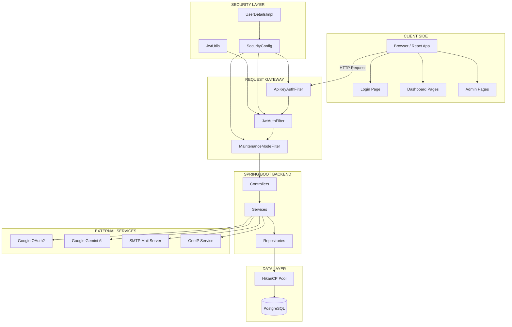

---

## 4. Database Schema

### 4.1 Entity Relationship Overview

```mermaid
erDiagram
    users {
        bigint id PK
        varchar username UK
        varchar email UK
        varchar password
        varchar first_name
        varchar last_name
        varchar avatar_url
        varchar status
        timestamp last_login
        timestamp created_at
        timestamp updated_at
        timestamp deleted_at
        int failed_login_attempts
        timestamp lockout_until
        bigint role_id FK
    }

    roles {
        bigint id PK
        varchar name UK
        varchar description
        timestamp created_at
    }

    permissions {
        bigint id PK
        varchar code UK
        varchar name
        timestamp created_at
    }

    role_permissions {
        bigint role_id FK
        bigint permission_id FK
    }

    user_preferences {
        bigint id PK
        bigint user_id FK
        varchar language
        varchar theme
        timestamp created_at
        timestamp updated_at
    }

    user_2fa {
        bigint id PK
        bigint user_id FK
        varchar secret_key
        boolean enabled
        text backup_codes
        timestamp last_used_totp_at
        timestamp created_at
        timestamp updated_at
    }

    refresh_tokens {
        bigint id PK
        bigint user_id FK
        varchar token UK
        timestamp expiry_date
        timestamp created_at
    }

    password_reset_tokens {
        bigint id PK
        varchar token UK
        timestamp expiry_date
        boolean used
        bigint user_id FK
        timestamp created_at
    }

    password_history {
        bigint id PK
        varchar password_hash
        timestamp changed_at
        bigint user_id FK
    }

    organizations {
        bigint id PK
        varchar name
        varchar slug UK
        varchar logo_url
        varchar primary_color
        varchar secondary_color
        varchar plan_type
        bigint owner_id FK
        timestamp created_at
        timestamp updated_at
    }

    organization_members {
        bigint id PK
        bigint organization_id FK
        bigint user_id FK
        varchar role
        timestamp joined_at
    }

    organization_invitations {
        bigint id PK
        bigint organization_id FK
        varchar email
        varchar token UK
        varchar role
        timestamp expires_at
        varchar status
        bigint invited_by FK
        timestamp created_at
    }

    teams {
        bigint id PK
        varchar name
        varchar description
        timestamp created_at
    }

    tasks {
        bigint id PK
        varchar title
        text description
        varchar status
        varchar priority
        bigint assigned_to FK
        bigint team_id FK
        date due_date
        timestamp created_at
        timestamp updated_at
    }

    task_comments {
        bigint id PK
        bigint task_id FK
        bigint user_id FK
        text comment
        timestamp created_at
    }

    files {
        bigint id PK
        varchar file_name
        varchar file_url
        varchar file_type
        bigint file_size
        bigint user_id FK
        timestamp uploaded_at
    }

    audit_logs {
        bigint id PK
        varchar action
        varchar entity_type
        bigint entity_id
        varchar ip_address
        text details
        bigint user_id FK
        timestamp created_at
    }

    notifications {
        bigint id PK
        varchar title
        text message
        boolean is_read
        bigint user_id FK
        timestamp created_at
    }

    events {
        bigint id PK
        varchar title
        text description
        timestamp start_date
        timestamp end_date
        varchar location
        bigint created_by FK
        timestamp created_at
        timestamp updated_at
    }

    event_attendees {
        bigint event_id FK
        bigint user_id FK
    }

    subscription_plans {
        bigint id PK
        varchar name UK
        decimal monthly_price
        decimal yearly_price
        int max_users
        int max_storage_mb
        timestamp created_at
    }

    subscriptions {
        bigint id PK
        bigint organization_id FK
        bigint plan_id FK
        varchar status
        varchar billing_cycle
        date start_date
        date end_date
        timestamp created_at
        timestamp updated_at
    }

    invoices {
        bigint id PK
        bigint subscription_id FK
        decimal amount
        varchar invoice_number UK
        varchar status
        timestamp issued_at
    }

    payments {
        bigint id PK
        bigint invoice_id FK
        decimal amount
        varchar payment_provider
        varchar status
        timestamp paid_at
    }

    webhook_endpoints {
        bigint id PK
        varchar name
        varchar url
        varchar secret
        varchar events_subscribed
        bigint organization_id
        boolean active
        timestamp created_at
        timestamp updated_at
    }

    webhook_deliveries {
        bigint id PK
        bigint webhook_endpoint_id FK
        varchar event_type
        text payload
        int status_code
        text response_body
        boolean success
        timestamp delivered_at
    }

    api_keys {
        bigint id PK
        varchar name
        varchar prefix
        varchar key_hash UK
        boolean revoked
        timestamp last_used_at
        timestamp expires_at
        bigint user_id FK
        int rate_limit_per_minute
        int rate_limit_per_hour
        timestamp created_at
    }

    api_key_scopes {
        bigint api_key_id FK
        varchar scope
    }

    system_settings {
        bigint id PK
        varchar setting_key UK
        text setting_value
        text description
        timestamp created_at
    }

    user_sessions {
        bigint id PK
        varchar ip_address
        varchar country
        varchar country_code
        text user_agent
        timestamp login_at
        timestamp logout_at
        bigint user_id FK
    }

    email_templates {
        bigint id PK
        varchar name UK
        varchar subject
        text content
        timestamp created_at
        timestamp updated_at
    }

    tickets {
        bigint id PK
        varchar subject
        varchar customer_name
        varchar status
        varchar priority
        timestamp created_at
        timestamp updated_at
    }

    ticket_messages {
        bigint id PK
        bigint ticket_id FK
        varchar sender_name
        text message
        boolean is_staff
        timestamp created_at
    }

    users ||--o{ refresh_tokens : "has"
    users ||--o{ password_reset_tokens : "has"
    users ||--o{ password_history : "has"
    users ||--|| user_preferences : "has"
    users ||--|| user_2fa : "has"
    users }o--|| roles : "assigned"
    roles }o--o{ permissions : "grants"
    role_permissions }o--|| roles : ""
    role_permissions }o--|| permissions : ""
    users ||--o{ user_sessions : "creates"
    users ||--o{ audit_logs : "generates"
    users ||--o{ notifications : "receives"
    users ||--o{ files : "uploads"
    users ||--o{ tasks : "assigned"
    users ||--o{ task_comments : "writes"
    users ||--o{ events : "creates"
    events }o--o{ users : "attends"
    organizations }o--|| users : "owned by"
    organizations ||--o{ organization_members : "has"
    organizations ||--o{ organization_invitations : "sends"
    organizations ||--o{ subscriptions : "has"
    subscriptions }o--|| subscription_plans : "uses"
    subscriptions ||--o{ invoices : "generates"
    invoices ||--o{ payments : "paid by"
    tasks }o--|| teams : "belongs"
    tasks ||--o{ task_comments : "has"
    webhook_endpoints ||--o{ webhook_deliveries : "generates"
    api_keys ||--o{ api_key_scopes : "has"
    tickets ||--o{ ticket_messages : "has"
```

### 4.2 Table Summary

| Table | Rows/Purpose | Key Relationships |
|---|---|---|
| `users` | All user accounts | → roles, organizations |
| `roles` | SUPER_ADMIN, ADMIN, MANAGER, USER | → permissions (M:M) |
| `permissions` | Granular permission codes | ← roles (M:M) |
| `role_permissions` | Join table roles↔permissions | — |
| `user_preferences` | Language, theme per user | → users (1:1) |
| `user_2fa` | TOTP secret, backup codes | → users (1:1) |
| `refresh_tokens` | JWT refresh tokens | → users (1:1) |
| `password_reset_tokens` | One-time reset tokens | → users |
| `password_history` | Last N password hashes | → users |
| `organizations` | Workspaces/tenants | → users (owner) |
| `organization_members` | User↔org membership | → organizations, users |
| `organization_invitations` | Pending invites | → organizations, users |
| `teams` | Work groups | — |
| `tasks` | Work items | → users (assignee), teams |
| `task_comments` | Comments on tasks | → tasks, users |
| `files` | Uploaded files metadata | → users |
| `audit_logs` | Immutable action log | → users |
| `notifications` | In-app notifications | → users |
| `events` | Calendar events | → users (creator, attendees) |
| `event_attendees` | Event↔user join | → events, users |
| `subscription_plans` | Plan catalog | — |
| `subscriptions` | Active subscriptions | → organizations, plans |
| `invoices` | Billing records | → subscriptions |
| `payments` | Payment records | → invoices |
| `webhook_endpoints` | Outbound webhook targets | → organizations |
| `webhook_deliveries` | Delivery attempt log | → webhook_endpoints |
| `api_keys` | Programmatic access keys | → users |
| `api_key_scopes` | Scopes per API key | → api_keys |
| `system_settings` | Key-value config | — |
| `user_sessions` | Login session records | → users |
| `email_templates` | Reusable email HTML | — |
| `tickets` | Support tickets | — |
| `ticket_messages` | Ticket conversation | → tickets |

---

## 5. Entity Classes

### Package: `com.vortexadmin.entity`

---

### `User`
```
@Entity @Table("users")

Fields:
  Long         id                    @Id @GeneratedValue
  String       username              @Column(unique, nullable=false)
  String       email                 @Column(unique, nullable=false)
  String       password              BCrypt encoded
  String       firstName
  String       lastName
  String       avatarUrl
  String       status                ACTIVE | INACTIVE | SUSPENDED
  LocalDateTime lastLogin
  LocalDateTime createdAt            @PrePersist
  LocalDateTime updatedAt            @PrePersist + @PreUpdate
  LocalDateTime deletedAt            soft-delete
  Integer      failedLoginAttempts   brute-force tracking
  LocalDateTime lockoutUntil         account lockout
  Role         role                  @ManyToOne(fetch=EAGER)

Lifecycle:
  @PrePersist  → sets createdAt, updatedAt
  @PreUpdate   → sets updatedAt
```

### `Role`
```
@Entity @Table("roles")

Fields:
  Long              id           @Id @GeneratedValue
  String            name         @Column(unique, nullable=false)
  String            description
  LocalDateTime     createdAt
  Set<Permission>   permissions  @ManyToMany(fetch=EAGER)
                                  @JoinTable("role_permissions")
```

### `Permission`
```
@Entity @Table("permissions")

Fields:
  Long          id    @Id @GeneratedValue
  String        code  @Column(unique)  e.g. "user.create"
  String        name  human-readable label
  LocalDateTime createdAt
```

### `UserPreference`
```
@Entity @Table("user_preferences")

Fields:
  Long          id        @Id @GeneratedValue
  User          user      @OneToOne
  String        language  "en" | "th" | "zh"
  String        theme     "dark" | "light"
  LocalDateTime createdAt
  LocalDateTime updatedAt
```

### `UserTwoFactor`
```
@Entity @Table("user_2fa")

Fields:
  Long          id              @Id @GeneratedValue
  User          user            @OneToOne
  String        secretKey       TOTP base32 secret
  Boolean       enabled         default false
  List<String>  backupCodes     BCrypt hashed codes
  LocalDateTime lastUsedTotpAt  replay-attack prevention
  LocalDateTime createdAt
  LocalDateTime updatedAt
```

### `RefreshToken`
```
@Entity @Table("refresh_tokens")

Fields:
  Long          id          @Id @GeneratedValue
  User          user        @OneToOne
  String        token       @Column(unique)  UUID
  Instant       expiryDate  7 days TTL
  LocalDateTime createdAt
```

### `PasswordResetToken`
```
@Entity @Table("password_reset_tokens")

Fields:
  Long          id          @Id @GeneratedValue
  String        token       @Column(unique)  UUID
  LocalDateTime expiryDate  1 hour TTL
  Boolean       used        one-time use
  User          user        @ManyToOne
  LocalDateTime createdAt
```

### `PasswordHistory`
```
@Entity @Table("password_history")

Fields:
  Long          id           @Id @GeneratedValue
  String        passwordHash BCrypt hash
  LocalDateTime changedAt
  User          user         @ManyToOne
```

### `Organization`
```
@Entity @Table("organizations")

Fields:
  Long          id              @Id @GeneratedValue
  String        name
  String        slug            @Column(unique)
  String        logoUrl
  String        primaryColor
  String        secondaryColor
  PlanType      planType        FREE | PRO | BUSINESS | ENTERPRISE
  User          owner           @ManyToOne
  LocalDateTime createdAt
  LocalDateTime updatedAt
```

### `OrganizationMember`
```
@Entity @Table("organization_members")
@UniqueConstraint(organization_id, user_id)

Fields:
  Long          id            @Id @GeneratedValue
  Organization  organization  @ManyToOne
  User          user          @ManyToOne
  String        role          OWNER | ADMIN | MEMBER
  LocalDateTime joinedAt
```

### `OrganizationInvitation`
```
@Entity @Table("organization_invitations")

Fields:
  Long          id            @Id @GeneratedValue
  Organization  organization  @ManyToOne
  String        email
  String        token         @Column(unique)  UUID
  String        role          ADMIN | MEMBER
  LocalDateTime expiresAt     48 hours TTL
  String        status        PENDING | ACCEPTED | EXPIRED | REVOKED
  User          invitedBy     @ManyToOne
  LocalDateTime createdAt
```

### `Team`
```
@Entity @Table("teams")

Fields:
  Long          id          @Id @GeneratedValue
  String        name
  String        description
  LocalDateTime createdAt
```

### `Task`
```
@Entity @Table("tasks")

Fields:
  Long          id          @Id @GeneratedValue
  String        title
  String        description @Column(columnDefinition="TEXT")
  TaskStatus    status      TODO | IN_PROGRESS | DONE
  TaskPriority  priority    LOW | MEDIUM | HIGH
  User          assignedTo  @ManyToOne
  Team          team        @ManyToOne
  LocalDate     dueDate
  LocalDateTime createdAt
  LocalDateTime updatedAt
```

### `TaskComment`
```
@Entity @Table("task_comments")

Fields:
  Long          id        @Id @GeneratedValue
  Task          task      @ManyToOne
  User          user      @ManyToOne
  String        comment   @Column(columnDefinition="TEXT")
  LocalDateTime createdAt
```

### `File`
```
@Entity @Table("files")

Fields:
  Long          id         @Id @GeneratedValue
  String        fileName
  String        fileUrl
  String        fileType
  Long          fileSize
  User          user       @ManyToOne
  LocalDateTime uploadedAt
```

### `AuditLog`
```
@Entity @Table("audit_logs")

Fields:
  Long          id         @Id @GeneratedValue
  String        action     e.g. "USER_CREATED", "LOGIN_FAILED"
  String        entityType e.g. "User", "Task"
  Long          entityId
  String        ipAddress
  String        details    @Column(columnDefinition="TEXT")  JSON
  User          user       @ManyToOne
  LocalDateTime createdAt
```

### `Notification`
```
@Entity @Table("notifications")

Fields:
  Long          id        @Id @GeneratedValue
  String        title
  String        message   @Column(columnDefinition="TEXT")
  Boolean       isRead    default false
  User          user      @ManyToOne
  LocalDateTime createdAt
```

### `Event`
```
@Entity @Table("events")

Fields:
  Long          id          @Id @GeneratedValue
  String        title
  String        description @Column(columnDefinition="TEXT")
  LocalDateTime startDate
  LocalDateTime endDate
  String        location
  User          createdBy   @ManyToOne
  List<User>    attendees   @ManyToMany
  LocalDateTime createdAt
  LocalDateTime updatedAt
```

### `SubscriptionPlan`
```
@Entity @Table("subscription_plans")

Fields:
  Long          id            @Id @GeneratedValue
  String        name          @Column(unique)
  BigDecimal    monthlyPrice
  BigDecimal    yearlyPrice
  Integer       maxUsers
  Integer       maxStorageMb
  LocalDateTime createdAt
```

### `Subscription`
```
@Entity @Table("subscriptions")

Fields:
  Long            id            @Id @GeneratedValue
  Organization    organization  @ManyToOne
  SubscriptionPlan plan         @ManyToOne
  String          status        ACTIVE | CANCELLED | EXPIRED
  String          billingCycle  MONTHLY | YEARLY
  LocalDate       startDate
  LocalDate       endDate
  LocalDateTime   createdAt
  LocalDateTime   updatedAt
```

### `Invoice`
```
@Entity @Table("invoices")

Fields:
  Long          id             @Id @GeneratedValue
  Subscription  subscription   @ManyToOne
  BigDecimal    amount
  String        invoiceNumber  @Column(unique)
  String        status         PAID | PENDING | FAILED | REFUNDED
  LocalDateTime issuedAt
```

### `Payment`
```
@Entity @Table("payments")

Fields:
  Long          id              @Id @GeneratedValue
  Invoice       invoice         @ManyToOne
  BigDecimal    amount
  String        paymentProvider MOCK | STRIPE | PROMPTPAY
  String        status          SUCCESS | FAILED | PENDING
  LocalDateTime paidAt
```

### `WebhookEndpoint`
```
@Entity @Table("webhook_endpoints")

Fields:
  Long          id                 @Id @GeneratedValue
  String        name
  String        url
  String        secret             HMAC signing secret
  String        eventsSubscribed   comma-separated event types
  Long          organizationId
  Boolean       active
  LocalDateTime createdAt
  LocalDateTime updatedAt
```

### `WebhookDelivery`
```
@Entity @Table("webhook_deliveries")

Fields:
  Long            id               @Id @GeneratedValue
  WebhookEndpoint webhookEndpoint  @ManyToOne
  String          eventType
  String          payload          @Column(columnDefinition="TEXT")  JSON
  Integer         statusCode       HTTP response code
  String          responseBody     @Column(columnDefinition="TEXT")
  Boolean         success
  LocalDateTime   deliveredAt
```

### `ApiKey`
```
@Entity @Table("api_keys")

Fields:
  Long          id                 @Id @GeneratedValue
  String        name
  String        prefix             first 8 chars (shown to user)
  String        keyHash            @Column(unique)  SHA-256 hash
  Boolean       revoked            default false
  LocalDateTime lastUsedAt
  LocalDateTime expiresAt
  User          user               @ManyToOne
  Integer       rateLimitPerMinute
  Integer       rateLimitPerHour
  LocalDateTime createdAt
  List<String>  scopes             @ElementCollection
```

### `SystemSetting`
```
@Entity @Table("system_settings")

Fields:
  Long          id           @Id @GeneratedValue
  String        settingKey   @Column(unique)
  String        settingValue @Column(columnDefinition="TEXT")
  String        description  @Column(columnDefinition="TEXT")
  LocalDateTime createdAt
```

### `UserSession`
```
@Entity @Table("user_sessions")

Fields:
  Long          id          @Id @GeneratedValue
  String        ipAddress
  String        country
  String        countryCode
  String        userAgent   @Column(columnDefinition="TEXT")
  LocalDateTime loginAt
  LocalDateTime logoutAt
  User          user        @ManyToOne
```

### `EmailTemplate`
```
@Entity @Table("email_templates")

Fields:
  Long          id        @Id @GeneratedValue
  String        name      @Column(unique)
  String        subject
  String        content   @Column(columnDefinition="TEXT")  HTML
  LocalDateTime createdAt
  LocalDateTime updatedAt
```

### `Ticket`
```
@Entity @Table("tickets")  [package: model.entity]

Fields:
  Long          id           @Id @GeneratedValue
  String        subject
  String        customerName
  String        status       Open | In Progress | Resolved
  String        priority     Low | Medium | High
  LocalDateTime createdAt
  LocalDateTime updatedAt
```

### `TicketMessage`
```
@Entity @Table("ticket_messages")  [package: model.entity]

Fields:
  Long          id         @Id @GeneratedValue
  Long          ticketId
  String        senderName
  String        message    @Column(columnDefinition="TEXT")
  Boolean       isStaff
  LocalDateTime createdAt
```

---

## 6. DTO Classes

### 6.1 Request DTOs — `com.vortexadmin.dto.request`

#### Authentication
| DTO | Fields |
|---|---|
| `LoginRequest` | username, password, twoFactorCode |
| `RegisterRequest` | username, email, password, companyName, firstName, lastName |
| `GoogleLoginRequest` | idToken |
| `ChangePasswordRequest` | oldPassword, newPassword |
| `ForgotPasswordRequest` | email |
| `ResetPasswordRequest` | token, newPassword |
| `TokenRefreshRequest` | refreshToken |
| `TwoFactorVerifyRequest` | code |

#### User Management
| DTO | Fields |
|---|---|
| `UserCreateRequest` | username, email, password, firstName, lastName, roleId |
| `UserUpdateRequest` | firstName, lastName, roleId, status |
| `UpdateMyProfileRequest` | firstName, lastName, email |
| `BulkActionRequest` | userIds[], action |

#### Organization & Teams
| DTO | Fields |
|---|---|
| `OrganizationRequest` | name, slug, logoUrl, primaryColor, secondaryColor |
| `InviteMemberRequest` | email, role (ADMIN/MEMBER) |
| `AcceptInvitationRequest` | token |
| `TeamRequest` | name, description |

#### Tasks & Events
| DTO | Fields |
|---|---|
| `TaskRequest` | title, description, status, priority, assignedTo, teamId, dueDate |
| `TaskCommentRequest` | comment |
| `EventRequest` | title, description, startDate, endDate, location, attendeeIds[] |

#### Settings & Preferences
| DTO | Fields |
|---|---|
| `PreferenceRequest` | language (en/th/zh), theme (dark/light) |
| `SettingRequest` | key, value |

#### Webhooks & API Keys
| DTO | Fields |
|---|---|
| `WebhookEndpointRequest` | name, url, events[], active |
| `CreateApiKeyRequest` | name, expiresInDays, scopes[], rateLimitPerMinute, rateLimitPerHour |

#### Billing
| DTO | Fields |
|---|---|
| `UpgradePlanRequest` | organizationId, planName, billingCycle (MONTHLY/YEARLY), paymentProvider |

#### Files
| DTO | Fields |
|---|---|
| `FileRequest` | fileName, fileUrl, fileType, size, folderId |

---

### 6.2 Response DTOs — `com.vortexadmin.dto.response`

#### Authentication
```
JwtResponse:
  String  token           access JWT (24h)
  String  type            "Bearer"
  String  refreshToken    refresh JWT (7d)
  Long    id
  String  username
  String  email
  Long    companyId
  List    roles
  Boolean twoFactorRequired
```

#### User
```
UserProfileResponse:
  Long    id
  String  username
  String  email
  String  firstName
  String  lastName
  String  avatarUrl
  String  status
  String  roleName
  String  companyName
```

#### Organization
```
OrganizationResponse:
  Long    id
  String  name
  String  slug
  String  logoUrl
  String  primaryColor
  String  secondaryColor
  String  planType
  Long    ownerId
  String  ownerName
  Integer memberCount
  String  currentUserRole
  LocalDateTime createdAt
  LocalDateTime updatedAt

OrganizationMemberResponse:
  Long    id, userId
  String  username, email, fullName, avatarUrl
  String  role
  LocalDateTime joinedAt

InvitationResponse:
  Long    id, organizationId
  String  organizationName, email, token, role, status
  LocalDateTime expiresAt, createdAt
```

#### Roles & Permissions
```
RoleResponse:
  Long    id
  String  name, description
  List<PermissionResponse> permissions

PermissionResponse:
  Long    id
  String  code, name
```

#### Tasks & Teams
```
TaskResponse:
  Long    id
  String  title, description, status, priority
  Long    assignedToId
  String  assignedToUsername
  Long    teamId
  String  teamName
  LocalDate dueDate
  LocalDateTime createdAt, updatedAt

TaskCommentResponse:
  Long    id, taskId, userId
  String  username, avatarUrl, comment
  LocalDateTime createdAt

TeamResponse:
  Long    id
  String  name, description
  LocalDateTime createdAt
```

#### Dashboard
```
DashboardDataResponse:
  StatCards:
    totalUsers, activeUsers, totalTeams, totalTasks
    totalEvents, unreadNotifications
    + trend values for each

  ChartData:
    userGrowthChart[]    {name, value}
    taskActivityChart[]  {name, todo, inProgress, done}
    loginActivityChart[] {name, count}

  DistributionData:
    roleDistribution[]  {name, count}

  SystemHealth:
    cpuUsage, memoryUsage, storageUsage
    databaseStatus (string)

  List<ActivityDto>:
    title, desc, time, type

  List<UserDto>:
    id, username, email, status, avatarText
```

#### Reports
```
ReportStatsResponse:
  KpiCards:
    totalRevenue, revenueTrend
    activeUsers, activeUsersTrend
    systemActivity, activityTrend
    conversionRate, conversionTrend

  revenueChart[]:    {name, revenue, expenses}
  userGrowthChart[]: {name, active, newUsers}
```

#### Billing
```
PlanResponse:
  Long    id
  String  name
  BigDecimal monthlyPrice, yearlyPrice
  Integer maxUsers, maxStorageMb

SubscriptionResponse:
  Long    id, organizationId
  String  organizationName
  PlanResponse plan
  String  status, billingCycle
  LocalDate startDate, endDate
  Integer currentUsers, maxUsers
  Integer storageUsedMb, maxStorageMb

InvoiceResponse:
  Long    id
  String  invoiceNumber, status, planName
  BigDecimal amount
  LocalDateTime issuedAt

DiscountEligibilityResponse:
  Boolean eligible
  Integer discountPercentage
```

#### Security
```
TwoFactorSetupResponse:
  String secret
  String otpAuthUrl   (otpauth:// URI for QR code)

TwoFactorStatusResponse:
  Boolean enabled
  Integer remainingBackupCodes
  List<String> backupCodes  (only on first setup)

SessionResponse:
  Long    id
  String  ipAddress, userAgent
  LocalDateTime loginAt, logoutAt
  Boolean active
```

#### Webhooks & API Keys
```
WebhookEndpointResponse:
  Long    id
  String  name, url
  List    events
  Boolean active
  LocalDateTime createdAt
  String  secret  (only returned once at creation)

WebhookDeliveryResponse:
  Long    id
  String  eventType, responseBody
  Integer statusCode
  Boolean success
  LocalDateTime deliveredAt

ApiKeyResponse:
  Long    id
  String  name, prefix
  Boolean revoked
  LocalDateTime lastUsedAt, expiresAt, createdAt
```

#### Utilities
```
ExportFileResponse:
  String  fileName
  String  contentType
  byte[]  content

AuditLogResponse:
  Long    id
  String  action, entityName
  Long    entityId
  String  details, ipAddress
  Long    userId
  String  username
  LocalDateTime createdAt
```

---

## 7. Repository Layer

### Package: `com.vortexadmin.repository`

All repositories extend `JpaRepository<Entity, Long>` unless noted.

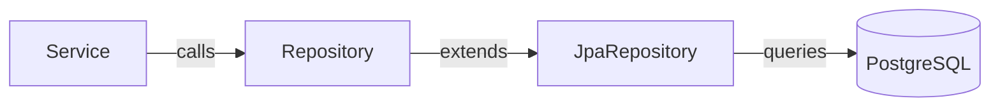

| Repository | Custom Query Methods |
|---|---|
| `UserRepository` | `findByUsernameAndDeletedAtIsNull(String)` → Optional<User> |
| | `findByEmailAndDeletedAtIsNull(String)` → Optional<User> |
| | `existsByUsername(String)`, `existsByEmail(String)` |
| | `findAllByDeletedAtIsNull()` |
| `RoleRepository` | `findByName(String)` → Optional<Role> |
| `PermissionRepository` | `findByCode(String)` → Optional<Permission> |
| `RefreshTokenRepository` | `findByToken(String)` → Optional<RefreshToken> |
| | `deleteByUser(User)` |
| `PasswordResetTokenRepository` | `findByToken(String)` → Optional |
| | `findByUserAndUsedFalse(User)` |
| `PasswordHistoryRepository` | `findByUserOrderByChangedAtDesc(User)` |
| `OrganizationRepository` | `findBySlug(String)` → Optional |
| | `findByOwner(User)` |
| `OrganizationMemberRepository` | `findByOrganizationAndUser(Org, User)` |
| | `countByOrganization(Org)` |
| | `findByUser(User)` |
| `OrganizationInvitationRepository` | `findByToken(String)` |
| | `findByEmailAndStatus(String, status)` |
| `TaskRepository` | `findByTeam(Team)` |
| | `findByAssignedTo(User)` |
| | `countByStatus(TaskStatus)` |
| `TaskCommentRepository` | `findByTask(Task)` |
| `TeamRepository` | `findByName(String)` |
| `FileRepository` | `findByUser(User)` |
| `AuditLogRepository` | `findByUserOrderByCreatedAtDesc(User)` |
| | `findAllByOrderByCreatedAtDesc()` |
| `NotificationRepository` | `findByUserAndIsReadFalse(User)` |
| | `countByUserAndIsReadFalse(User)` |
| | `findByUserOrderByCreatedAtDesc(User)` |
| `ApiKeyRepository` | `findByKeyHash(String)` |
| | `findByUserAndRevokedFalse(User)` |
| `WebhookEndpointRepository` | `findByOrganizationIdAndActiveTrue(Long)` |
| `WebhookDeliveryRepository` | `findByWebhookEndpoint(WebhookEndpoint)` |
| `SystemSettingRepository` | `findBySettingKey(String)` |
| `UserSessionRepository` | `findByUser(User)` |
| | `findByUserAndLogoutAtIsNull(User)` |
| `SubscriptionRepository` | `findByOrganization(Organization)` |
| `UserPreferenceRepository` | `findByUser(User)` |
| `UserTwoFactorRepository` | `findByUser(User)` |
| `EventRepository` | `findByCreatedByOrAttendeesContaining(User, User)` |
| `EmailTemplateRepository` | `findByName(String)` |
| `TicketRepository` | Standard JPA |
| `TicketMessageRepository` | `findByTicketId(Long)` |
| `PaymentRepository` | `findByInvoice(Invoice)` |
| `SubscriptionPlanRepository` | `findByName(String)` |

---

## 8. Service Layer

### Package: `com.vortexadmin.service` (interfaces) + `service.impl` (implementations)

---

### `AuthService` / `AuthServiceImpl`

```
Methods:
  JwtResponse authenticateUser(LoginRequest request, HttpServletRequest httpReq)
    1. AuthenticationManager.authenticate(UsernamePasswordAuthenticationToken)
    2. Check if user account is locked (failedLoginAttempts, lockoutUntil)
    3. If 2FA enabled → return {twoFactorRequired: true}
    4. Else validate twoFactorCode if provided
    5. Generate JWT access token (JwtUtils.generateJwtToken)
    6. Generate UUID refresh token → save to refresh_tokens
    7. Log audit: USER_LOGIN
    8. Record UserSession (IP, UserAgent, country via GeoLocationService)
    9. Reset failedLoginAttempts on success
    10. Return JwtResponse

  JwtResponse authenticateWithGoogle(String idToken, HttpServletRequest)
    1. Verify ID token with Google API
    2. Extract email, name, picture from GoogleIdToken
    3. Find or create User by email
    4. Generate JWT + refresh token
    5. Return JwtResponse

  void registerUser(RegisterRequest)
    1. Validate username/email uniqueness
    2. Encode password (BCryptPasswordEncoder)
    3. Resolve default USER role
    4. Create and save User
    5. Create Organization with user as owner
    6. Create OrganizationMember (OWNER)
    7. Log audit: USER_REGISTERED

  JwtResponse refreshToken(TokenRefreshRequest)
    1. Find refresh token by value
    2. Validate not expired
    3. Generate new JWT for the user
    4. Return new JwtResponse (same refresh token)

  void logout(String refreshToken)
    1. Delete refresh token from DB
    2. Log UserSession.logoutAt

  void forgotPassword(String email)
    1. Find user by email (no error if not found - security)
    2. Generate UUID token
    3. Save PasswordResetToken (1h TTL)
    4. Send email via MailService

  void resetPassword(String token, String newPassword)
    1. Find valid, unused PasswordResetToken
    2. Check not expired
    3. Validate new password via PasswordPolicyService
    4. Check not in password history
    5. Encode and save new password
    6. Save old hash to PasswordHistory
    7. Mark token as used
    8. Invalidate refresh tokens (logout all sessions)
```

---

### `UserService` / `UserServiceImpl`

```
Methods:
  UserProfileResponse getMyProfile()
    → Load currently authenticated user from SecurityContext
    → Map to UserProfileResponse

  void updateMyProfile(UpdateMyProfileRequest)
    → Update firstName, lastName, email
    → Check email uniqueness if changed
    → Save user

  void changeMyPassword(ChangePasswordRequest)
    → Verify oldPassword matches BCrypt
    → Validate newPassword via PasswordPolicyService
    → Check PasswordHistory (no reuse)
    → Save BCrypt(newPassword)
    → Append to password_history

  List<UserProfileResponse> getAllUsersInMyCompany()
    → Get current user's organization
    → Return all members of that organization

  UserProfileResponse getUserById(Long id)
    → findByIdAndDeletedAtIsNull or throw 404

  void createUser(UserCreateRequest)
    → Validate username/email uniqueness
    → Encode password
    → Resolve role
    → Save User
    → Add to current organization
    → Log audit: USER_CREATED
    → Send welcome email via MailService

  void updateUser(Long id, UserUpdateRequest)
    → Load user, apply updates
    → Log audit: USER_UPDATED

  void deleteUser(Long id)
    → Set deletedAt = now (soft delete)
    → Revoke refresh tokens
    → Log audit: USER_DELETED

  int importUsersFromCsv(MultipartFile)
    → Parse CSV (Apache Commons CSV)
    → For each row: createUser
    → Return count of imported users

  UserActivityResponse getUserActivity(Long id)
    → Load AuditLogs for user
    → Load UserSessions for user
    → Aggregate into response

  Map<String, Long> getGeoStats()
    → Query user_sessions grouped by country
    → Return {country: count} map

  void bulkAction(BulkActionRequest)
    → For action=DELETE: soft-delete all listed users
    → For action=CHANGE_ROLE: update roles
    → Log audit per user

  List<UserProfileResponse> searchUsers(String q)
    → Search by username/email/firstName/lastName LIKE %q%
```

---

### `TwoFactorService` / `TwoFactorServiceImpl`

```
Methods:
  TwoFactorStatusResponse getStatus()
    → Load UserTwoFactor for current user
    → Return {enabled, remainingBackupCodes}

  TwoFactorSetupResponse setup()
    → Generate TOTP secret (GoogleAuthenticator)
    → Save to user_2fa (enabled=false)
    → Return {secret, otpAuthUrl}

  TwoFactorStatusResponse verifyAndEnable(String code)
    → Load TOTP secret for user
    → Validate code against secret
    → Generate 10 backup codes (BCrypt hash each)
    → Set enabled=true
    → Return response with plain-text backup codes (one-time display)

  void disable(String code)
    → Validate TOTP code or backup code
    → Set enabled=false
    → Clear backup codes
```

---

### `OrganizationService` / `OrganizationServiceImpl`

```
Methods:
  OrganizationResponse createOrganization(OrganizationRequest)
    → Validate slug uniqueness
    → Save organization (owner = current user)
    → Add current user as OWNER member

  List<OrganizationResponse> getMyOrganizations()
    → Find all OrganizationMembers for current user
    → Map organizations with memberCount, currentUserRole

  OrganizationResponse updateOrganization(Long id, OrganizationRequest)
    → Validate current user has OWNER/ADMIN role in org
    → Update and save

  void deleteOrganization(Long id)
    → Validate current user is OWNER
    → Delete members, invitations, subscriptions
    → Delete organization

  List<OrganizationMemberResponse> getMembers(Long orgId)
    → Find all OrganizationMembers for org
    → Map to response

  void removeMember(Long orgId, Long userId)
    → Validate not removing owner
    → Delete OrganizationMember

  InvitationResponse inviteMember(Long orgId, InviteMemberRequest)
    → Check user not already a member
    → Generate UUID token
    → Save OrganizationInvitation (48h TTL)
    → Send email via MailService
    → Return InvitationResponse

  OrganizationResponse acceptInvitation(String token)
    → Find invitation by token
    → Validate not expired, status=PENDING
    → Add user as OrganizationMember
    → Set invitation status=ACCEPTED
```

---

### `TaskService` / `TaskServiceImpl`

```
Methods:
  List<TaskResponse> getAllTasks()
    → Return all tasks (SUPER_ADMIN/ADMIN: all; others: own tasks)

  TaskResponse createTask(TaskRequest)
    → Validate assignedTo user exists
    → Validate team exists
    → Save task
    → Send notification to assignedTo user
    → Log audit: TASK_CREATED

  void updateTask(Long id, TaskRequest)
    → Load task, apply changes
    → Log audit: TASK_UPDATED

  void deleteTask(Long id)
    → Delete task and comments
    → Log audit: TASK_DELETED
```

---

### `DashboardService` / `DashboardServiceImpl`

```
Methods:
  DashboardDataResponse getDashboardStats()
    → Count users, active users, teams, tasks by status
    → Count events, unread notifications
    → Calculate trends (current vs last month %)
    → Build userGrowthChart (12 months of user creations)
    → Build taskActivityChart (last 7 days by status)
    → Build loginActivityChart (last 7 days login count)
    → Calculate roleDistribution (count per role)
    → Get system health (CPU %, RAM %, disk %, DB ping)
    → Get recent 10 audit log activities
    → Get recent 5 users
```

---

### `BillingService` / `BillingServiceImpl`

```
Methods:
  List<PlanResponse> getPlans()
    → Return all SubscriptionPlans

  SubscriptionResponse getSubscription(Long orgId)
    → Find active subscription for org
    → Count current members, storage used
    → Return with usage metrics

  SubscriptionResponse upgradePlan(UpgradePlanRequest)
    → Load organization and plan
    → Cancel existing subscription if any
    → Create new Subscription (ACTIVE)
    → Create Invoice (PAID)
    → Create Payment record
    → Update organization.planType
    → Log audit: SUBSCRIPTION_UPGRADED

  DiscountEligibilityResponse getDiscountEligibility(Long orgId)
    → Check if org is on FREE plan longer than 90 days
    → Return discount eligibility (e.g., 20% off first year)
```

---

### `ApiKeyService` / `ApiKeyServiceImpl`

```
Methods:
  ApiKeyResponse createKey(CreateApiKeyRequest)
    → Generate 32-char random key
    → Store prefix (first 8 chars) + SHA-256 hash
    → Save ApiKey with scopes, rate limits, expiry
    → Return full key ONCE in response

  List<ApiKeyResponse> getMyKeys()
    → Return all non-revoked keys for current user
    → Keys are shown as prefix + "****"

  void revokeKey(Long id)
    → Set revoked=true
    → Log audit: API_KEY_REVOKED
```

---

### `WebhookService` / `WebhookServiceImpl`

```
Methods:
  WebhookEndpointResponse createEndpoint(WebhookEndpointRequest)
    → Generate HMAC signing secret
    → Save endpoint
    → Return with secret (shown once)

  void sendTestEvent(Long endpointId)
    → Load endpoint
    → Build test payload JSON
    → HTTP POST to endpoint URL with X-Vortex-Signature header
    → Save WebhookDelivery record

  Internal: fireEvent(String eventType, Object payload)
    → Find all active endpoints subscribed to eventType
    → For each: sign payload with HMAC-SHA256
    → HTTP POST async
    → Save WebhookDelivery
```

---

### `NotificationService` / `NotificationServiceImpl`

```
Methods:
  List<NotificationResponse> getMyNotifications()
    → Load all notifications for current user (ordered by createdAt DESC)

  Long getUnreadCount()
    → countByUserAndIsReadFalse(currentUser)

  void markAsRead(Long notificationId)
    → Set isRead=true

  void createNotification(User user, String title, String message)
    → Save Notification
    → Push to SseEmitterService for real-time delivery
```

---

### `SseEmitterService`

```
Fields:
  Map<Long, List<SseEmitter>> emitters  (userId → active SSE connections)

Methods:
  SseEmitter subscribe(Long userId)
    → Create new SseEmitter (5 min timeout)
    → Register in emitters map
    → On completion/timeout: remove from map
    → Return emitter (connected to /api/notifications/stream)

  void broadcast(Long userId, Object data)
    → Find all emitters for userId
    → For each: emitter.send(SseEmitter.event().data(data))
    → Remove dead emitters
```

---

### `AuditLogService` / `AuditLogServiceImpl`

```
Methods:
  List<AuditLogResponse> getCompanyAuditLogs()
    → Load logs for current user's company
    → Order by createdAt DESC

  void logAction(String action, String entityType, Long entityId, String details)
    → Get current user from SecurityContext
    → Get IP from HttpServletRequest
    → Save AuditLog
```

---

### `GeoLocationService`

```
Methods:
  String getCountryFromIp(String ipAddress)
    → Query MaxMind or IP-API for geolocation
    → Return country name

  String getCountryCodeFromIp(String ipAddress)
    → Return ISO country code (e.g., "TH", "US")
```

---

### `PasswordPolicyService`

```
Methods:
  void validate(String password)
    → Min 8 characters
    → Must contain uppercase, lowercase, digit, special char
    → Throw ApiException if invalid

  boolean isPasswordReused(User user, String rawPassword)
    → Load last 5 PasswordHistory entries for user
    → BCryptPasswordEncoder.matches(rawPassword, hash)
    → Return true if any match
```

---

### `AiService`

```
Methods:
  String analyzeAuditLogs(String prompt)
    → Load recent 100 audit log entries
    → Build prompt: "Analyze these audit logs: ..."
    → Call Google Gemini API (gemini-pro model)
    → Return AI-generated insight text
```

---

### `ExportService`

```
Methods:
  byte[] exportToExcel(List<Map<String, Object>> data, List<String> columns)
    → Apache POI: create Workbook, Sheet, rows
    → Return .xlsx byte array

  byte[] exportToCsv(List<Map<String, Object>> data, List<String> columns)
    → Build CSV string with header row
    → Return UTF-8 bytes
```

---

### `MailService`

```
Methods:
  void sendPasswordResetEmail(String to, String token)
  void sendWelcomeEmail(String to, String username)
  void sendInvitationEmail(String to, String orgName, String token)
  void sendNotificationEmail(String to, String title, String message)
  
  Internal: void send(String to, String subject, String htmlContent)
    → JavaMailSender.send(MimeMessage)
    → Attach from: vortex.app.mailFrom
```

---

### `ApiRateLimitService`

```
Fields:
  Map<Long, Deque<Long>> minuteBuckets  (apiKeyId → timestamps)
  Map<Long, Deque<Long>> hourBuckets

Methods:
  boolean isAllowed(ApiKey key)
    → Check minute bucket: count requests in last 60s
    → Check hour bucket: count requests in last 3600s
    → Return false if either limit exceeded
    → Add current timestamp to buckets
```

---

### `ReportStatsService` / `ReportExportService`

```
ReportStatsService.getReportStats(String timeframe):
  → timeframe: "7d" | "30d" | "90d" | "1y"
  → Calculate KPI values from audit_logs, users, subscriptions
  → Build revenue chart from invoices
  → Build user growth chart from user creation dates

ReportExportService.export(String reportType, String format):
  → reportType: "users" | "audit" | "revenue"
  → format: "csv" | "excel"
  → Load data from respective repositories
  → Call ExportService.exportToCsv or exportToExcel
  → Return ExportFileResponse
```

---

## 9. Controller Layer (REST API)

### Base URL: `http://localhost:8080/api`

### `AuthController` — `/api/auth`

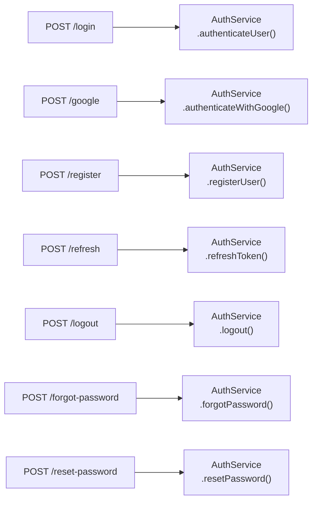

| Method | Path | Request Body | Response | Auth |
|---|---|---|---|---|
| POST | `/login` | LoginRequest | JwtResponse | Public |
| POST | `/google` | GoogleLoginRequest | JwtResponse | Public |
| POST | `/register` | RegisterRequest | ApiResponse | Public |
| POST | `/refresh` | TokenRefreshRequest | JwtResponse | Public |
| POST | `/logout` | TokenRefreshRequest | ApiResponse | JWT |
| POST | `/forgot-password` | ForgotPasswordRequest | ApiResponse | Public |
| POST | `/reset-password` | ResetPasswordRequest | ApiResponse | Public |

---

### `UserController` — `/api/users`

| Method | Path | Permission | Description |
|---|---|---|---|
| GET | `/me` | profile.view | Get own profile |
| PUT | `/me` | profile.update | Update own profile |
| POST | `/me/change-password` | password.change | Change password |
| GET | `/` | user.read | List all users in company |
| GET | `/search?q=` | authenticated | Search users |
| GET | `/{id}` | user.read | Get user by ID |
| POST | `/` | user.create | Create new user |
| PUT | `/{id}` | user.update | Update user |
| DELETE | `/{id}` | user.delete | Soft-delete user |
| GET | `/export?format=` | user.read | Export CSV/Excel |
| POST | `/import` | user.create | Import from CSV |
| GET | `/{id}/activity` | user.read | User activity history |
| GET | `/geo-stats` | user.read | Geographic stats |
| POST | `/bulk-action` | user.update | Bulk delete/role-change |

---

### `OrganizationController` — `/api/organizations`

| Method | Path | Permission | Description |
|---|---|---|---|
| POST | `/` | organization.create | Create organization |
| GET | `/` | authenticated | List my organizations |
| GET | `/{id}` | authenticated | Get organization |
| PUT | `/{id}` | organization.manage | Update organization |
| DELETE | `/{id}` | organization.delete | Delete organization |
| GET | `/{id}/members` | authenticated | List members |
| DELETE | `/{id}/members/{userId}` | organization.manage | Remove member |
| POST | `/{id}/invite` | organization.invite | Send invitation |
| GET | `/{id}/invitations` | organization.invite | List invitations |
| DELETE | `/{id}/invitations/{invId}` | organization.invite | Revoke invitation |

---

### `RoleController` — `/api/roles`

| Method | Path | Permission | Description |
|---|---|---|---|
| GET | `/` | role.read | List all roles |
| GET | `/permissions` | role.read | List all permissions |
| GET | `/{id}` | role.read | Get role by ID |
| POST | `/` | role.create | Create role |
| PUT | `/{id}` | role.update | Update role |
| DELETE | `/{id}` | role.delete | Delete role |

---

### `TaskController` — `/api/tasks`

| Method | Path | Permission | Description |
|---|---|---|---|
| GET | `/` | task.read | List all tasks |
| GET | `/team/{teamId}` | task.read | Tasks by team |
| GET | `/assignee/{userId}` | task.read | Tasks by assignee |
| GET | `/{id}` | task.read | Get task |
| POST | `/` | task.create | Create task |
| PUT | `/{id}` | task.update | Update task |
| DELETE | `/{id}` | task.delete | Delete task |

---

### `TaskCommentController` — `/api/task-comments`

| Method | Path | Permission | Description |
|---|---|---|---|
| GET | `/{taskId}` | task.read | Get comments for task |
| POST | `/` | task.create | Add comment |
| DELETE | `/{id}` | task.delete | Delete comment |

---

### `TeamController` — `/api/teams`

| Method | Path | Permission | Description |
|---|---|---|---|
| GET | `/` | team.read | List teams |
| GET | `/{id}` | team.read | Get team |
| POST | `/` | team.create | Create team |
| PUT | `/{id}` | team.update | Update team |
| DELETE | `/{id}` | team.delete | Delete team |

---

### `FileController` — `/api/files`

| Method | Path | Permission | Description |
|---|---|---|---|
| GET | `/` | file.read | My files |
| POST | `/upload-record` | file.upload | Record file metadata |
| POST | `/upload` | file.upload | Upload actual file |
| GET | `/download/{id}` | file.read | Download file |
| PUT | `/{id}` | file.upload | Rename file |
| DELETE | `/{id}` | file.delete | Delete file |

---

### `DashboardController` — `/api/dashboard`

| Method | Path | Permission | Description |
|---|---|---|---|
| GET | `/stats` | dashboard.view | Full dashboard data |

---

### `TwoFactorController` — `/api/2fa`

| Method | Path | Auth | Description |
|---|---|---|---|
| GET | `/status` | JWT | Get 2FA status |
| POST | `/setup` | JWT | Generate TOTP secret |
| POST | `/verify` | JWT | Enable 2FA |
| POST | `/disable` | JWT | Disable 2FA |

---

### `BillingController` — `/api/billing`

| Method | Path | Auth | Description |
|---|---|---|---|
| GET | `/plans` | Public | List plans |
| GET | `/subscription?orgId=` | JWT | Get subscription |
| GET | `/invoices?orgId=` | JWT | List invoices |
| POST | `/upgrade` | JWT | Upgrade plan |
| POST | `/cancel?orgId=` | JWT | Cancel subscription |
| GET | `/discounts?orgId=` | JWT | Discount eligibility |

---

### `ApiKeyController` — `/api/api-keys`

| Method | Path | Permission | Description |
|---|---|---|---|
| POST | `/` | settings.manage | Create API key |
| GET | `/` | settings.manage | List my API keys |
| DELETE | `/{id}` | settings.manage | Revoke API key |

---

### `WebhookController` — `/api/webhooks`

| Method | Path | Permission | Description |
|---|---|---|---|
| GET | `/` | settings.manage | List endpoints |
| POST | `/` | settings.manage | Create endpoint |
| PUT | `/{id}` | settings.manage | Update endpoint |
| DELETE | `/{id}` | settings.manage | Delete endpoint |
| GET | `/{id}/deliveries` | settings.manage | Delivery history |
| POST | `/{id}/test` | settings.manage | Send test event |

---

### `AuditLogController` — `/api/audit-logs`

| Method | Path | Permission | Description |
|---|---|---|---|
| GET | `/` | audit.read | List audit logs |
| GET | `/export?format=` | audit.read | Export logs |

---

### `NotificationController` — `/api/notifications`

| Method | Path | Permission | Description |
|---|---|---|---|
| GET | `/stream` | notification.read | SSE stream |
| GET | `/` | notification.read | List notifications |
| GET | `/unread-count` | notification.read | Unread count |
| PUT | `/{id}/read` | notification.read | Mark as read |

---

### `ReportController` — `/api/reports`

| Method | Path | Permission | Description |
|---|---|---|---|
| GET | `/stats?timeframe=` | report.view | KPI & chart data |
| GET | `/{type}/export?format=` | report.export | Export report |

---

### `EventController` — `/api/events`

| Method | Path | Permission | Description |
|---|---|---|---|
| GET | `/` | calendar.read | List events |
| GET | `/{id}` | calendar.read | Get event |
| POST | `/` | calendar.create | Create event |
| PUT | `/{id}` | calendar.update | Update event |
| DELETE | `/{id}` | calendar.update | Delete event |

---

### `SessionController` — `/api/sessions`

| Method | Path | Auth | Description |
|---|---|---|---|
| GET | `/` | JWT | List my sessions |
| DELETE | `/{id}` | JWT | Revoke session |
| DELETE | `/` | JWT | Revoke all other sessions |

---

### `InvitationController` — `/api/invitations`

| Method | Path | Auth | Description |
|---|---|---|---|
| GET | `/pending` | JWT | My pending invitations |
| POST | `/accept` | JWT | Accept invitation |

---

### `PreferenceController` — `/api/preferences`

| Method | Path | Auth | Description |
|---|---|---|---|
| GET | `/` | JWT | Get preferences |
| PUT | `/` | JWT | Update preferences |

---

### `AiController` — `/api/ai`

| Method | Path | Auth | Description |
|---|---|---|---|
| POST | `/insights` | SUPER_ADMIN | AI audit analysis |

---

### `SearchController` — `/api/search`

| Method | Path | Auth | Description |
|---|---|---|---|
| GET | `/?q=` | JWT | Global search |

---

### `SystemSettingController` — `/api/settings`

| Method | Path | Permission | Description |
|---|---|---|---|
| GET | `/` | settings.manage | List settings |
| PUT | `/` | settings.manage | Update setting |

---

### `TicketController` — `/api/tickets`

| Method | Path | Auth | Description |
|---|---|---|---|
| GET | `/` | JWT | List tickets |
| POST | `/` | JWT | Create ticket |
| GET | `/{id}` | JWT | Get ticket |
| PUT | `/{id}` | JWT | Update ticket status |
| GET | `/{id}/messages` | JWT | Get messages |
| POST | `/{id}/messages` | JWT | Reply to ticket |

---

### `EmailTemplateController` — `/api/email-templates`

| Method | Path | Permission | Description |
|---|---|---|---|
| GET | `/` | settings.manage | List templates |
| POST | `/` | settings.manage | Create template |
| PUT | `/{id}` | settings.manage | Update template |
| DELETE | `/{id}` | settings.manage | Delete template |

---

## 10. Security Architecture

### Security Filter Chain

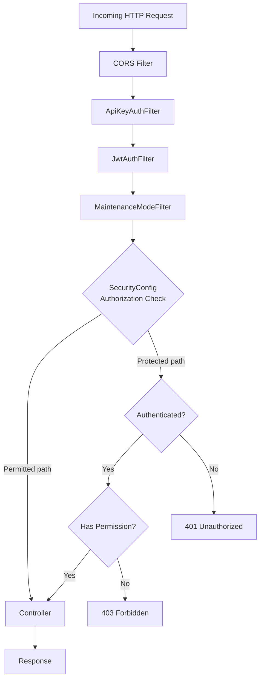

### `JwtUtils`

```
Fields:
  String jwtSecret    from env JWT_SECRET
  int jwtExpirationMs = 86400000 (24 hours)

Methods:
  String generateJwtToken(Authentication auth)
    → Subject: username
    → Claims: userId, roles[]
    → Signed: HMAC-SHA512 with jwtSecret
    → Expiry: 24 hours

  String getUserNameFromJwtToken(String token)
    → Jwts.parser().verifyWith(key).parseSignedClaims(token).getSubject()

  boolean validateJwtToken(String token)
    → Parse and verify signature
    → Check not expired
    → Return true/false (no exception propagation)
```

### `JwtAuthFilter` extends `OncePerRequestFilter`

```
doFilterInternal(request, response, filterChain):
  1. Extract token from Authorization: Bearer <token> header
  2. If token present:
     a. validateJwtToken(token)
     b. Extract username
     c. Load UserDetails via UserDetailsServiceImpl
     d. Check user status (not SUSPENDED)
     e. Create UsernamePasswordAuthenticationToken
     f. Set authentication in SecurityContextHolder
  3. filterChain.doFilter(request, response)
```

### `ApiKeyAuthFilter` extends `OncePerRequestFilter`

```
doFilterInternal(request, response, filterChain):
  1. Extract X-API-Key header
  2. If present:
     a. SHA-256 hash the key
     b. Look up ApiKey by keyHash
     c. Validate not revoked, not expired
     d. Check ApiRateLimitService.isAllowed(apiKey)
     e. Update apiKey.lastUsedAt
     f. Load user and set SecurityContext with api-key scopes
  3. filterChain.doFilter(request, response)
```

### `MaintenanceModeFilter` extends `OncePerRequestFilter`

```
doFilterInternal(request, response, filterChain):
  1. Load system setting "maintenance_mode"
  2. If "true" AND not SUPER_ADMIN:
     → Return 503 Service Unavailable
  3. Else: filterChain.doFilter()
```

### `SecurityConfig`

```
Permitted paths (no auth):
  /api/auth/**
  /api/public/**
  /swagger-ui/**
  /v3/api-docs/**
  /actuator/health
  /actuator/info

Protected paths:
  /actuator/**  → ROLE_SUPER_ADMIN only
  All others   → authenticated

CORS:
  allowedOrigins: from config (localhost:5173 dev)
  allowedMethods: GET, POST, PUT, DELETE, OPTIONS
  allowedHeaders: *
  allowCredentials: true

Session: STATELESS
CSRF: disabled

OAuth2:
  Provider: Google
  UserService: CustomOAuth2UserService
  SuccessHandler: issues JWT on OAuth2 success
```

### `UserDetailsImpl` implements `UserDetails`

```
Fields:
  Long    userId
  String  username
  String  email
  String  password
  String  status
  Collection<GrantedAuthority> authorities

Static factory:
  build(User user)
    → Authorities from user.role.permissions
    → Each permission.code becomes SimpleGrantedAuthority

isEnabled():
  → return !"SUSPENDED".equals(status) && !"INACTIVE".equals(status)
```

---

## 11. Authentication & Authorization Flow

### 11.1 Login Flow

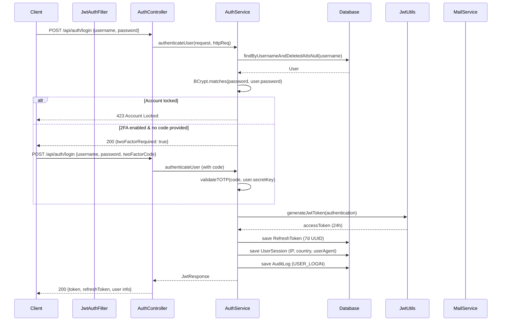

### 11.2 Token Refresh Flow

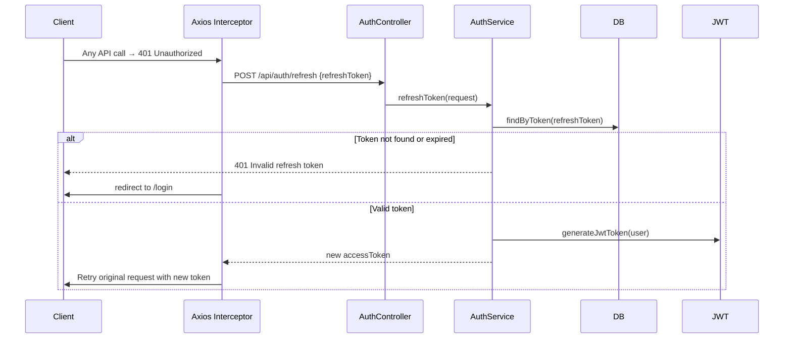

### 11.3 OAuth2 Flow (Google)

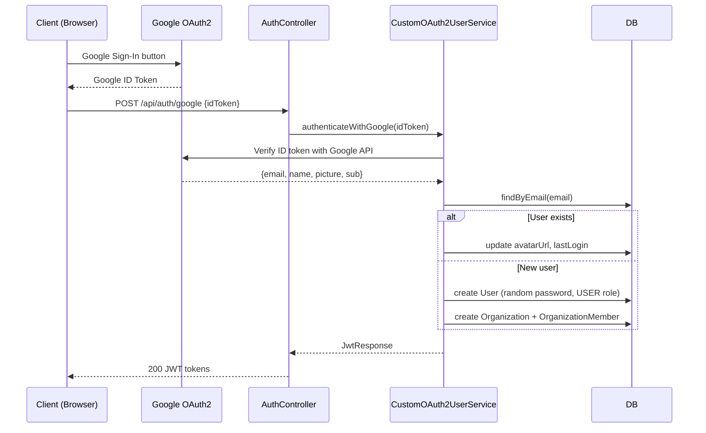

### 11.4 Request Authorization Flow

```mermaid
flowchart TD
    REQ[API Request] --> API_KEY{X-API-Key\nheader?}
    API_KEY -->|Yes| HASH[SHA-256 hash key]
    HASH --> LOOKUP[Find in api_keys table]
    LOOKUP --> VALID_KEY{Valid?\nNot revoked?\nNot expired?}
    VALID_KEY -->|No| 401_KEY[401 Unauthorized]
    VALID_KEY -->|Yes| RATE{Rate limit\ncheck}
    RATE -->|Exceeded| 429[429 Too Many Requests]
    RATE -->|OK| SET_CTX1[Set SecurityContext\nwith key scopes]
    
    API_KEY -->|No| JWT_HDR{Authorization:\nBearer header?}
    JWT_HDR -->|No| PUBLIC{Public\nendpoint?}
    PUBLIC -->|Yes| CTRL[Controller]
    PUBLIC -->|No| 401_NO[401 Unauthorized]
    
    JWT_HDR -->|Yes| VALIDATE[JwtUtils.validate(token)]
    VALIDATE -->|Invalid/Expired| 401_JWT[401 Unauthorized]
    VALIDATE -->|Valid| LOAD_USER[Load UserDetails]
    LOAD_USER --> SUSPENDED{User\nSUSPENDED?}
    SUSPENDED -->|Yes| 403_SUSP[403 Forbidden]
    SUSPENDED -->|No| SET_CTX2[Set SecurityContext\nwith permissions]
    
    SET_CTX1 --> PERM[@PreAuthorize check]
    SET_CTX2 --> PERM
    PERM -->|No permission| 403[403 Forbidden]
    PERM -->|Has permission| CTRL
```

---

## 12. Frontend Architecture

### 12.1 Directory Structure

```
frontend/src/
├── api/
│   └── axios.js           # Configured Axios instance + interceptors
├── components/
│   ├── layout/
│   │   ├── Layout.jsx     # Main wrapper with Sidebar + Navbar
│   │   ├── Navbar.jsx     # Top navigation bar
│   │   ├── Sidebar.jsx    # Left navigation menu
│   │   └── Breadcrumbs.jsx
│   ├── ui/
│   │   ├── Skeleton.jsx   # Loading skeletons
│   │   ├── EmptyState.jsx # Empty state placeholder
│   │   ├── Toast.jsx      # Toast notification system
│   │   ├── GlobalDialog.jsx
│   │   └── ModalPortal.jsx
│   ├── modals/
│   │   ├── UserModal.jsx
│   │   ├── ImportModal.jsx
│   │   └── ShortcutsModal.jsx
│   ├── CommandPalette.jsx # Cmd+K quick navigation
│   ├── GlobalSearch.jsx
│   ├── LanguageSwitcher.jsx
│   ├── TwoFactorSettings.jsx
│   ├── TourGuide.jsx
│   ├── UserManualModal.jsx
│   └── WorkspaceSwitcher.jsx
├── context/
│   └── AuthContext.jsx    # Authentication state + methods
├── hooks/
│   ├── useAuth.js         # useContext(AuthContext)
│   ├── useTheme.js        # useContext(ThemeContext)
│   ├── ThemeProvider.jsx  # Dark/light theme manager
│   └── useGlobalSearch.js
├── pages/
│   ├── auth/
│   │   ├── Login.jsx
│   │   ├── Register.jsx
│   │   ├── ForgotPassword.jsx
│   │   └── ResetPassword.jsx
│   ├── Home.jsx           # Dashboard
│   ├── Welcome.jsx
│   ├── Profile.jsx
│   ├── Users.jsx
│   ├── Roles.jsx
│   ├── Teams.jsx
│   ├── Tasks.jsx
│   ├── Calendar.jsx
│   ├── Files.jsx
│   ├── Organizations.jsx
│   ├── Billing.jsx
│   ├── Notifications.jsx
│   ├── Reports.jsx
│   ├── AuditLogs.jsx
│   ├── ApiKeys.jsx
│   ├── Settings.jsx
│   ├── Tickets.jsx
│   ├── Webhooks.jsx
│   ├── SystemHealth.jsx
│   ├── EmailBuilder.jsx
│   └── Docs.jsx
├── router/
│   ├── PrivateRoute.jsx   # JWT auth guard
│   └── RoleRoute.jsx      # Role-based route guard
├── services/
│   ├── organizationService.js
│   ├── billingService.js
│   ├── preferenceService.js
│   ├── reportService.js
│   └── twoFactorService.js
├── store/
│   └── organizationStore.js  # Zustand store
├── utils/
│   ├── dialog.js         # Custom confirm/alert dialogs
│   ├── sseClient.js      # SSE connection manager
│   └── toastHelper.js    # Toast utility
├── locales/
│   ├── en/translation.json
│   ├── th/translation.json
│   └── zh/translation.json
├── App.jsx               # Routes definition
├── main.jsx              # Entry point
└── i18n.js               # i18next configuration
```

### 12.2 Routing Structure

```mermaid
graph TD
    APP[App.jsx] --> PUBLIC[Public Routes]
    APP --> PRIVATE[PrivateRoute wrapper]

    PUBLIC --> LOGIN[/login → Login.jsx]
    PUBLIC --> REG[/register → Register.jsx]
    PUBLIC --> FORGOT[/forgot-password]
    PUBLIC --> RESET[/reset-password]
    PUBLIC --> OAUTH[/oauth2/callback]

    PRIVATE --> WELCOME[/ → Welcome.jsx]
    PRIVATE --> DASH[/dashboard → Home.jsx]
    PRIVATE --> PROFILE[/profile → Profile.jsx]
    PRIVATE --> ORGS[/organizations → Organizations.jsx]
    PRIVATE --> TASKS[/tasks → Tasks.jsx]
    PRIVATE --> CAL[/calendar → Calendar.jsx]
    PRIVATE --> FILES[/files → Files.jsx]
    PRIVATE --> TICKETS[/tickets → Tickets.jsx]
    PRIVATE --> NOTIF[/notifications → Notifications.jsx]
    PRIVATE --> BILLING[/billing → Billing.jsx]
    PRIVATE --> DOCS[/docs → Docs.jsx]

    PRIVATE --> ROLE[RoleRoute wrappers]
    ROLE --> USERS["/users → [SUPER_ADMIN, ADMIN]"]
    ROLE --> ROLES["/roles → [SUPER_ADMIN, ADMIN]"]
    ROLE --> TEAMS["/teams → [SUPER_ADMIN, ADMIN, MANAGER]"]
    ROLE --> REPORTS["/reports → [SUPER_ADMIN, ADMIN, MANAGER]"]
    ROLE --> APIKEYS["/api-keys → [SUPER_ADMIN]"]
    ROLE --> AUDIT["/audit-logs → [SUPER_ADMIN, ADMIN]"]
    ROLE --> SETTINGS["/settings → [SUPER_ADMIN]"]
    ROLE --> WEBHOOKS["/settings/webhooks → [SUPER_ADMIN]"]
    ROLE --> HEALTH["/system-health → [SUPER_ADMIN]"]
    ROLE --> EMAIL_B["/email-builder → [SUPER_ADMIN, ADMIN]"]
```

### 12.3 `PrivateRoute` Logic

```
PrivateRoute.jsx:
  → Read token from localStorage
  → If no token → <Navigate to="/login" />
  → Decode JWT (jwtDecode)
  → If expired → clear localStorage → <Navigate to="/login" />
  → Else → render <Outlet />
```

### 12.4 `RoleRoute` Logic

```
RoleRoute({ allowedRoles }):
  → const { user } = useAuth()
  → Check user.roles.some(r => allowedRoles.includes(r))
  → If not allowed → <Navigate to="/dashboard" />
  → Else → render <Outlet />
```

---

## 13. State Management

### `AuthContext` — `context/AuthContext.jsx`

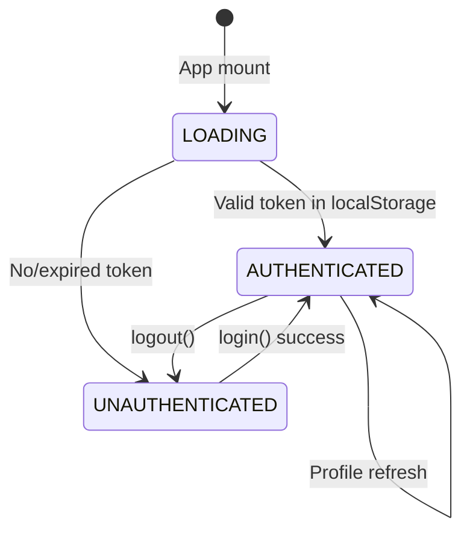

```
State:
  user: {
    username, email, firstName, lastName
    avatarUrl, status, roleName
    roles[],      ← from JWT
    permissions[] ← from JWT
  }
  loading: boolean

Methods:
  login(username, password, twoFactorCode)
    → POST /api/auth/login
    → localStorage.setItem('token', ...)
    → localStorage.setItem('refreshToken', ...)
    → Decode JWT → set user state
    → Fetch /users/me for full profile
    → Fetch /preferences → i18n.changeLanguage()
    → Return {twoFactorRequired}

  loginWithGoogle(accessToken)
    → POST /api/auth/google
    → Same flow as login

  logout()
    → POST /api/auth/logout {refreshToken}
    → localStorage.clear()
    → organizationStore.clear()
    → navigate('/login')

  register(...)
    → POST /api/auth/register

  forgotPassword(email)
    → POST /api/auth/forgot-password

  resetPassword(token, newPassword)
    → POST /api/auth/reset-password

useEffect (onMount):
  → Check localStorage for token
  → jwtDecode(token) → check exp
  → If valid: set user from JWT
  → Fetch /users/me for full profile
  → Set loading = false
```

### `OrganizationStore` — Zustand — `store/organizationStore.js`

```
State:
  organizations: Organization[]
  currentOrgId: Long | null  (persisted to localStorage)
  loading: boolean

Actions:
  fetchOrganizations()
    → GET /api/organizations
    → set organizations
    → If no currentOrgId, default to first org

  setCurrentOrg(orgId)
    → set currentOrgId
    → localStorage.setItem('currentOrgId', orgId)

  getCurrentOrg()
    → organizations.find(o => o.id === currentOrgId)

  clear()
    → reset all state
    → localStorage.removeItem('currentOrgId')
```

### `ThemeContext` — `hooks/ThemeProvider.jsx`

```
State:
  theme: 'dark' | 'light'  (from localStorage or system preference)

Actions:
  toggleTheme()
    → flip theme
    → localStorage.setItem('theme', newTheme)
    → document.documentElement.classList.toggle('dark')
```

---

## 14. API Service Layer (Frontend)

### `api/axios.js` — Configured Instance

```
baseURL: import.meta.env.VITE_API_URL  (e.g. http://localhost:8080/api)

Request interceptor:
  → headers.Authorization = "Bearer " + localStorage.getItem('token')

Response interceptor (success):
  → Pass through

Response interceptor (error):
  401 Unauthorized:
    → If not already retrying:
       1. POST /auth/refresh {refreshToken}
       2. If success: save new token, retry original request
       3. If fail: clear storage, redirect to /login
    → If already retrying: clear storage, redirect to /login

  5xx Server errors (not during refresh):
    → toast.error("Server Error", "Backend unavailable")

  Network error (offline):
    → toast.error("Offline", "Cannot reach backend")
```

### `services/organizationService.js`

| Function | Method | Path |
|---|---|---|
| `getMyOrganizations()` | GET | `/organizations` |
| `createOrganization(data)` | POST | `/organizations` |
| `updateOrganization(id, data)` | PUT | `/organizations/{id}` |
| `deleteOrganization(id)` | DELETE | `/organizations/{id}` |
| `getMembers(orgId)` | GET | `/organizations/{id}/members` |
| `removeMember(orgId, userId)` | DELETE | `/organizations/{id}/members/{userId}` |
| `inviteMember(orgId, email, role)` | POST | `/organizations/{id}/invite` |
| `getInvitations(orgId)` | GET | `/organizations/{id}/invitations` |
| `revokeInvitation(orgId, invId)` | DELETE | `/organizations/{id}/invitations/{invId}` |
| `getMyPendingInvitations()` | GET | `/invitations/pending` |
| `acceptInvitation(token)` | POST | `/invitations/accept` |

### `services/billingService.js`

| Function | Method | Path |
|---|---|---|
| `getPlans()` | GET | `/billing/plans` |
| `getSubscription(orgId)` | GET | `/billing/subscription?orgId={id}` |
| `getInvoices(orgId)` | GET | `/billing/invoices?orgId={id}` |
| `upgradePlan(data)` | POST | `/billing/upgrade` |
| `cancelSubscription(orgId)` | POST | `/billing/cancel?orgId={id}` |
| `getDiscounts(orgId)` | GET | `/billing/discounts?orgId={id}` |

### `services/twoFactorService.js`

| Function | Method | Path |
|---|---|---|
| `getStatus()` | GET | `/2fa/status` |
| `setup()` | POST | `/2fa/setup` |
| `verify(code)` | POST | `/2fa/verify` |
| `disable(code)` | POST | `/2fa/disable` |

### `services/preferenceService.js`

| Function | Method | Path |
|---|---|---|
| `getMyPreferences()` | GET | `/preferences` |
| `updateMyPreferences(data)` | PUT | `/preferences` |

### `services/reportService.js`

| Function | Method | Path |
|---|---|---|
| `getReportStats(timeframe)` | GET | `/reports/stats?timeframe={tf}` |
| `exportReport(type, format)` | GET | `/reports/{type}/export?format={fmt}` |

---

## 15. Feature Flowcharts

### 15.1 User Registration Flow

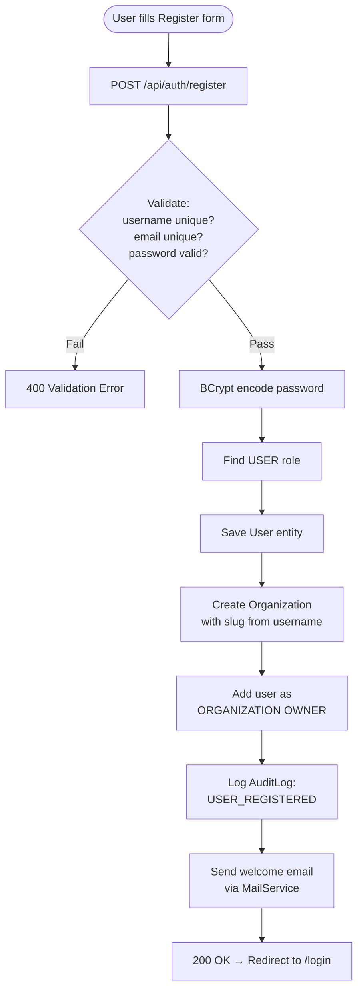

### 15.2 Task Kanban Flow

```mermaid
flowchart TD
    LOAD([Tasks page loads]) --> FETCH[GET /api/tasks]
    FETCH --> RENDER[Render 3 columns:\nTODO | IN_PROGRESS | DONE]
    
    DRAG([User drags task card]) --> DROP[Drop in new column]
    DROP --> UPDATE[PUT /api/tasks/{id}\n{status: newColumn}]
    UPDATE --> DB[(Update DB)]
    DB --> REFRESH[Re-render board]
    
    NEW([+ New Task button]) --> MODAL[Open task modal]
    MODAL --> FILL[Fill: title, desc,\npriority, assignee, team, due]
    FILL --> POST[POST /api/tasks]
    POST --> NOTIFY[Create Notification\nfor assignee]
    NOTIFY --> AUDIT2[Log AuditLog:\nTASK_CREATED]
    AUDIT2 --> REFRESH
    
    COMMENT([Open task → comment]) --> POST_C[POST /api/task-comments\n{taskId, comment}]
    POST_C --> SHOW[Append to comment list]
```

### 15.3 Two-Factor Authentication Setup

```mermaid
flowchart TD
    START([Profile → 2FA Settings]) --> STATUS[GET /api/2fa/status]
    STATUS -->|disabled| BTN[Show "Enable 2FA" button]
    
    BTN --> SETUP[POST /api/2fa/setup]
    SETUP --> QR[Display QR code\notpauth:// URI + secret]
    QR --> SCAN[User scans with\nauthenticator app]
    SCAN --> ENTER[User enters 6-digit TOTP code]
    ENTER --> VERIFY[POST /api/2fa/verify\n{code}]
    VERIFY --> CHECK{Valid TOTP?}
    CHECK -->|No| ERROR[Show error, retry]
    CHECK -->|Yes| BACKUP[Generate 10 backup codes\nBCrypt hash and save]
    BACKUP --> DISPLAY[Display backup codes\nONE TIME ONLY]
    DISPLAY --> ENABLED[2FA now enabled]
    
    ENABLED --> DISABLE([User clicks Disable])
    DISABLE --> ENTER_CODE[Enter current TOTP/backup code]
    ENTER_CODE --> POST_DIS[POST /api/2fa/disable]
    POST_DIS --> CLEARED[Clear secret + backup codes]
```

### 15.4 File Upload Flow

```mermaid
flowchart TD
    START([Files page]) --> UPLOAD_BTN[Click Upload]
    UPLOAD_BTN --> SELECT[Select file from disk]
    SELECT --> POST_FILE[POST /api/files/upload\nMultipartFile]
    POST_FILE --> SAVE_DISK[Save to local storage\n/uploads/ directory]
    SAVE_DISK --> SAVE_META[Save File entity:\nfileName, fileUrl, fileType, size, user]
    SAVE_META --> RESP[Return FileResponse]
    RESP --> REFRESH[Reload file list]
    
    DOWNLOAD([Click Download]) --> GET[GET /api/files/download/{id}]
    GET --> AUTH{Owns file\nor admin?}
    AUTH -->|No| 403[403 Forbidden]
    AUTH -->|Yes| STREAM[Stream file bytes\nContent-Disposition: attachment]
    
    DELETE_FILE([Click Delete]) --> CONFIRM[Confirm dialog]
    CONFIRM --> DEL[DELETE /api/files/{id}]
    DEL --> DEL_DISK[Delete from disk]
    DEL_DISK --> DEL_DB[Delete File entity]
    DEL_DB --> REFRESH2[Reload file list]
```

### 15.5 Organization/Workspace Flow

```mermaid
flowchart TD
    LOGIN([User logs in]) --> FETCH_ORGS[GET /api/organizations\nfetch all user's orgs]
    FETCH_ORGS --> ZUSTAND[Store in OrganizationStore\nZustand]
    ZUSTAND --> DEFAULT[Default to currentOrgId\nfrom localStorage]
    
    SWITCH([WorkspaceSwitcher dropdown]) --> SELECT_ORG[Select org]
    SELECT_ORG --> SET_CURRENT[organizationStore.setCurrentOrg(id)]
    SET_CURRENT --> PERSIST[Save to localStorage]
    PERSIST --> RELOAD[Reload org-scoped data]
    
    INVITE([Admin invites member]) --> POST_INV[POST /api/organizations/{id}/invite\n{email, role: ADMIN|MEMBER}]
    POST_INV --> SAVE_INV[Save OrganizationInvitation\ntoken UUID, 48h TTL]
    SAVE_INV --> EMAIL[Send invitation email\nwith /accept?token=... link]
    
    ACCEPT([Invitee clicks link]) --> ACCEPT_REQ[POST /api/invitations/accept\n{token}]
    ACCEPT_REQ --> CHECK_EXP{Expired?}
    CHECK_EXP -->|Yes| ERR[Error: expired]
    CHECK_EXP -->|No| ADD_MEMBER[Create OrganizationMember\nrole=ADMIN|MEMBER]
    ADD_MEMBER --> UPDATE_INV[Set invitation status=ACCEPTED]
    UPDATE_INV --> SUCCESS[User is now a member]
```

### 15.6 API Key Flow

```mermaid
flowchart TD
    CREATE([Admin: Create API Key]) --> POST_KEY[POST /api/api-keys\n{name, expiresInDays, scopes[], rateLimits}]
    POST_KEY --> GEN_KEY[Generate 32-char random key]
    GEN_KEY --> PREFIX[Extract prefix (first 8 chars)]
    PREFIX --> HASH[SHA-256 hash full key]
    HASH --> SAVE_KEY[Save ApiKey:\nprefix, keyHash, scopes, rateLimits]
    SAVE_KEY --> RETURN_ONCE[Return FULL key in response\n(shown ONCE to user)]
    RETURN_ONCE --> COPY[User copies and stores key]
    
    USE_KEY([External app uses key]) --> HEADER[Set X-API-Key: vrtx_xxxx...]
    HEADER --> API_FILTER[ApiKeyAuthFilter]
    API_FILTER --> HASH2[SHA-256 hash incoming key]
    HASH2 --> LOOKUP[Find ApiKey by keyHash]
    LOOKUP --> CHECK_VALID{Valid?\nNot revoked?\nNot expired?}
    CHECK_VALID -->|No| 401[401 Unauthorized]
    CHECK_VALID -->|Yes| RATE_CHECK{Rate limit\ncheck}
    RATE_CHECK -->|Exceeded| 429[429 Too Many Requests]
    RATE_CHECK -->|OK| UPDATE_USED[Update lastUsedAt]
    UPDATE_USED --> SET_AUTH[Set authentication\nwith key scopes only]
    SET_AUTH --> CTRL[Proceed to Controller]
```

---

## 16. Permission Model

### Roles Hierarchy

```
SUPER_ADMIN
  └── Full system access (all permissions + actuator endpoints)
  
ADMIN
  └── Organization/user management
  
MANAGER
  └── Team/task management, reports
  
USER
  └── Basic access (own profile, tasks, files)
```

### Permission Codes

| Permission Code | Description | Default Roles |
|---|---|---|
| `user.create` | Create new users | SUPER_ADMIN, ADMIN |
| `user.read` | View users | SUPER_ADMIN, ADMIN |
| `user.update` | Modify users | SUPER_ADMIN, ADMIN |
| `user.delete` | Delete users | SUPER_ADMIN, ADMIN |
| `role.create` | Create roles | SUPER_ADMIN |
| `role.read` | View roles | SUPER_ADMIN, ADMIN |
| `role.update` | Modify roles | SUPER_ADMIN |
| `role.delete` | Delete roles | SUPER_ADMIN |
| `task.create` | Create tasks | SUPER_ADMIN, ADMIN, MANAGER, USER |
| `task.read` | View tasks | SUPER_ADMIN, ADMIN, MANAGER |
| `task.read.own` | View own tasks | USER |
| `task.update` | Update tasks | SUPER_ADMIN, ADMIN, MANAGER |
| `task.update.own` | Update own tasks | USER |
| `task.delete` | Delete tasks | SUPER_ADMIN, ADMIN, MANAGER |
| `task.delete.own` | Delete own tasks | USER |
| `team.create` | Create teams | SUPER_ADMIN, ADMIN, MANAGER |
| `team.read` | View teams | SUPER_ADMIN, ADMIN, MANAGER, USER |
| `team.update` | Modify teams | SUPER_ADMIN, ADMIN, MANAGER |
| `team.delete` | Delete teams | SUPER_ADMIN, ADMIN |
| `file.upload.own` | Upload files | All |
| `file.read.own` | Read own files | All |
| `file.read.all` | Read all files | SUPER_ADMIN, ADMIN |
| `file.delete.own` | Delete own files | All |
| `file.delete.all` | Delete all files | SUPER_ADMIN, ADMIN |
| `organization.create` | Create org | SUPER_ADMIN |
| `organization.manage` | Manage org | SUPER_ADMIN, ADMIN |
| `organization.invite` | Invite members | SUPER_ADMIN, ADMIN |
| `organization.delete` | Delete org | SUPER_ADMIN |
| `dashboard.view` | View dashboard | All |
| `audit.read` | View audit logs | SUPER_ADMIN, ADMIN |
| `report.view` | View reports | SUPER_ADMIN, ADMIN, MANAGER |
| `report.export` | Export reports | SUPER_ADMIN, ADMIN |
| `notification.read` | Read notifications | All |
| `calendar.create` | Create events | All |
| `calendar.read.own` | View own events | All |
| `calendar.update` | Update events | All |
| `settings.manage` | Manage settings | SUPER_ADMIN |
| `profile.view` | View own profile | All |
| `profile.update` | Update own profile | All |
| `password.change` | Change own password | All |

### Permission Enforcement

```mermaid
graph LR
    CTRL[Controller\n@PreAuthorize] --> SVC[Service\nbusiness logic]
    FRONTEND[Frontend\nRoleRoute + conditional rendering]
    
    SEC[SecurityContext\nGrantedAuthority from\nrole.permissions] --> CTRL
    AUTH[AuthContext\nuser.roles + permissions] --> FRONTEND
```

---

## 17. Real-Time Notification Flow

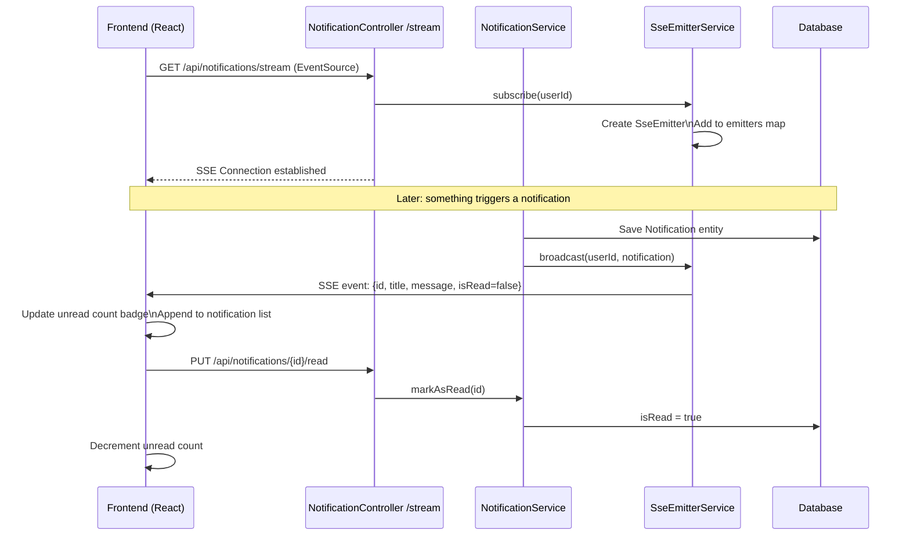

### `utils/sseClient.js`

```
createSseClient(userId):
  → new EventSource(`/api/notifications/stream`, {
      headers: { Authorization: "Bearer " + token }
    })
  → onmessage: parse data, call callback
  → onerror: reconnect after 5 seconds
  → return { close() }
```

---

## 18. File Upload Flow

```mermaid
flowchart LR
    CLIENT[React Client] -->|POST multipart/form-data| FC[FileController\n/api/files/upload]
    FC -->|MultipartFile| FS[FileService\n.uploadFile()]
    FS -->|Write to disk| DISK[/uploads/ directory\nspring.servlet.multipart]
    FS -->|Build URL| URL[fileUrl = /api/files/download/{id}]
    FS -->|Save| REPO[FileRepository\n.save(File entity)]
    REPO -->|Return| FC
    FC -->|FileResponse| CLIENT

    DOWNLOAD[Download request] -->|GET /api/files/download/{id}| FC2[FileController]
    FC2 -->|Check ownership| FS2[FileService]
    FS2 -->|Load from disk| DISK2[FileSystemResource]
    DISK2 -->|Stream bytes| CLIENT2[Client browser]
```

---

## 19. Billing & Subscription Flow

```mermaid
flowchart TD
    ORG([Organization created]) --> FREE[Default: FREE plan\nSubscription created]
    
    FREE --> VIEW_PLANS([Admin views Billing page])
    VIEW_PLANS --> FETCH_PLAN[GET /api/billing/plans]
    FETCH_PLAN --> SHOW_PLANS[Show plan cards:\nFREE / PRO / BUSINESS / ENTERPRISE]
    
    UPGRADE([Admin clicks Upgrade]) --> SELECT[Select plan + billing cycle\nMONTHLY or YEARLY]
    SELECT --> DISCOUNT_CHECK[GET /api/billing/discounts\nCheck eligibility]
    DISCOUNT_CHECK --> SHOW_PRICE[Show final price\n+ discount if eligible]
    SHOW_PRICE --> PAYMENT[Select payment provider:\nMOCK / STRIPE / PROMPTPAY]
    PAYMENT --> POST_UPGRADE[POST /api/billing/upgrade\n{orgId, planName, billingCycle, provider}]
    
    POST_UPGRADE --> CANCEL_OLD[Cancel existing subscription]
    CANCEL_OLD --> CREATE_SUB[Create new Subscription\nstatus=ACTIVE, dates set]
    CREATE_SUB --> CREATE_INV[Create Invoice\nstatus=PAID, invoiceNumber=INV-{timestamp}]
    CREATE_INV --> CREATE_PAY[Create Payment\nstatus=SUCCESS]
    CREATE_PAY --> UPDATE_ORG[Update Organization.planType]
    UPDATE_ORG --> AUDIT[Log SUBSCRIPTION_UPGRADED]
    AUDIT --> RESP[Return SubscriptionResponse]
    RESP --> REFRESH[Reload billing page]
    
    CANCEL([Admin cancels]) --> POST_CANCEL[POST /api/billing/cancel?orgId=]
    POST_CANCEL --> SET_CANCELLED[Set status=CANCELLED]
    SET_CANCELLED --> DOWNGRADE[Organization back to FREE]
```

---

## 20. Webhook Flow

```mermaid
sequenceDiagram
    participant ADMIN as Admin (Frontend)
    participant WC as WebhookController
    participant WS as WebhookService
    participant DB as Database
    participant EXT as External Endpoint URL

    ADMIN->>WC: POST /api/webhooks {name, url, events[]}
    WC->>WS: createEndpoint(request)
    WS->>WS: Generate HMAC signing secret
    WS->>DB: Save WebhookEndpoint
    WS-->>WC: response (secret shown once)
    WC-->>ADMIN: WebhookEndpointResponse + secret

    Note over WS,EXT: Internal event triggered (e.g., USER_CREATED)

    WS->>DB: Find active endpoints subscribed to event
    loop For each matching endpoint
        WS->>WS: Build JSON payload
        WS->>WS: HMAC-SHA256 sign payload with secret
        WS->>EXT: POST {payload}\nX-Vortex-Signature: {hmac}
        EXT-->>WS: HTTP Response
        WS->>DB: Save WebhookDelivery {statusCode, success}
    end

    ADMIN->>WC: POST /api/webhooks/{id}/test
    WC->>WS: sendTestEvent(endpointId)
    WS->>EXT: POST {test payload}
    EXT-->>WS: Response
    WS->>DB: Save WebhookDelivery
    WS-->>ADMIN: "Test event sent"
```

---

## Appendix A — Configuration Files

### `application.yaml` (Backend)

```yaml
server:
  port: 8080

spring:
  datasource:
    url: ${DB_URL:jdbc:postgresql://localhost:5432/vortex_admin}
    username: ${DB_USERNAME:postgres}
    password: ${DB_PASSWORD:postgres}
    hikari:
      minimum-idle: 2
      maximum-pool-size: 5
      connection-timeout: 20000

  jpa:
    hibernate:
      ddl-auto: update
    show-sql: false
    properties:
      hibernate.dialect: org.hibernate.dialect.PostgreSQLDialect

  mail:
    host: ${MAIL_HOST:smtp.gmail.com}
    port: ${MAIL_PORT:587}
    username: ${MAIL_USERNAME}
    password: ${MAIL_PASSWORD}
    properties:
      mail.smtp.auth: true
      mail.smtp.starttls.enable: true

vortex:
  app:
    jwtSecret: ${JWT_SECRET}
    frontendUrl: ${FRONTEND_URL:http://localhost:5173}
    mailFrom: ${MAIL_FROM:noreply@vortexadmin.com}
  ai:
    gemini:
      key: ${GEMINI_API_KEY}

cors:
  allowedOrigins: ${CORS_ORIGINS:http://localhost:5173}

management:
  endpoints:
    web:
      exposure:
        include: health,info,metrics
  endpoint:
    health:
      show-details: always
```

### `.env` (Frontend)

```env
VITE_API_URL=http://localhost:8080/api
VITE_GOOGLE_CLIENT_ID=your-google-client-id
```

---

## Appendix B — Error Response Format

### Standard Error (Validation)
```json
{
  "success": false,
  "message": "Validation failed",
  "errors": [
    "username: must not be blank",
    "email: must be a valid email"
  ]
}
```

### Business Logic Error
```json
{
  "success": false,
  "message": "Username already exists",
  "errors": null
}
```

### Standard Success
```json
{
  "success": true,
  "message": "Operation successful",
  "data": { ... }
}
```

### `GlobalExceptionHandler` handles:
| Exception | HTTP Status |
|---|---|
| `ApiException` | Custom status from exception |
| `MethodArgumentNotValidException` | 400 Bad Request |
| `UsernameNotFoundException` | 404 Not Found |
| `AccessDeniedException` | 403 Forbidden |
| `JwtException` | 401 Unauthorized |
| `Exception` (catch-all) | 500 Internal Server Error |

---

## Appendix C — i18n (Internationalization)

```
Supported locales:
  en  English  (default)
  th  Thai
  zh  Chinese (Simplified)

Translation key examples:
  auth.login            → "Login" / "เข้าสู่ระบบ" / "登录"
  auth.register         → "Register" / "สมัครสมาชิก" / "注册"
  users.title           → "Users" / "ผู้ใช้" / "用户"
  tasks.status.todo     → "To Do" / "รอดำเนินการ" / "待办"
  tasks.priority.high   → "High" / "สูง" / "高"

Language persistence:
  1. Login → fetch /api/preferences → language: "th"
  2. i18n.changeLanguage("th")
  3. On update preference → PUT /api/preferences {language: "th"}
     + localStorage.setItem("language", "th")
```

---

## Appendix D — Known Issues (Code Annotations)

| Bug ID | Location | Description |
|---|---|---|
| BUG-003 | `UserDetailsImpl.isEnabled()` | Suspended users can still use existing JWTs until expiry |
| BUG-004 | `SecurityConfig` CORS | Wildcard origins + allowCredentials = security risk in prod |
| BUG-005 | `JwtAuthFilter` | JWT via query param removed (was leaking in logs) |
| BUG-009 | `UserTwoFactor` | TOTP replay window not tracked → within-window reuse possible |
| BUG-030 | `AuthContext` onMount | Expired tokens not rejected on page refresh |
| BUG-031 | `AuthContext` login | Null profile not guarded after login |
| BUG-033 | `axios.js` interceptor | Toast shown during token refresh (duplicate UI feedback) |
| BUG-037 | `Users.jsx` bulk delete | Uses N individual DELETE calls instead of /bulk-action |

---

*Generated from full source analysis of Vortex Admin Pro — 2026-07-03*
